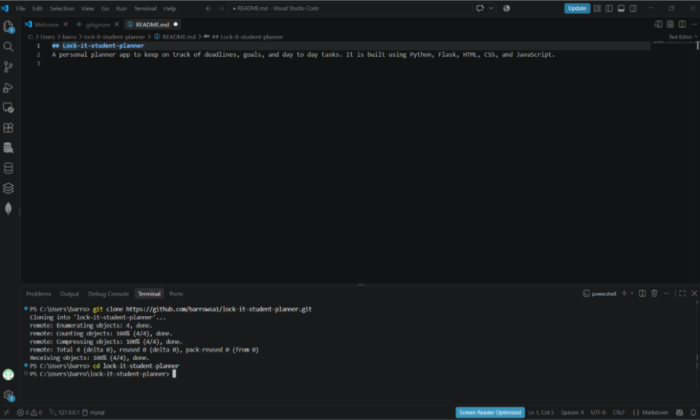
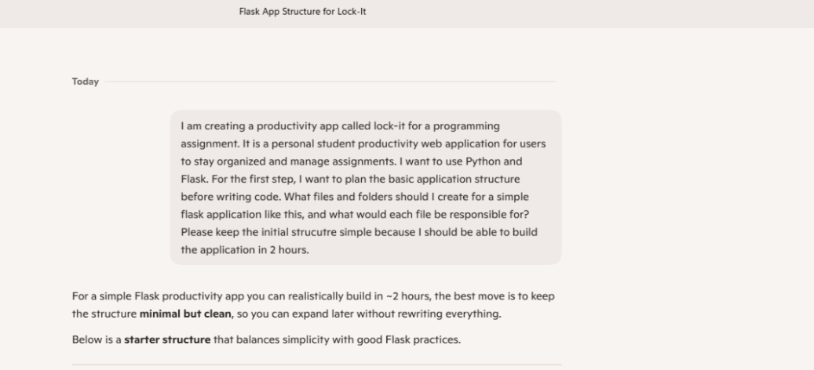
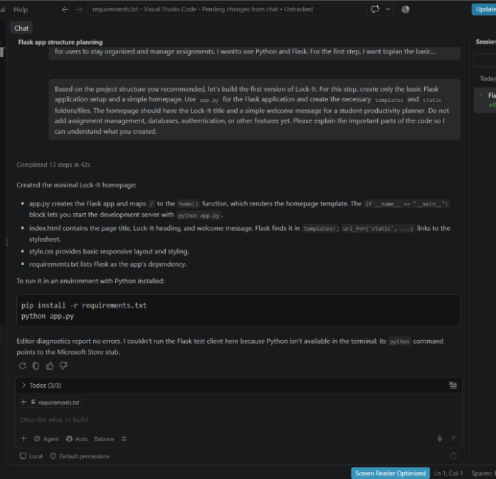
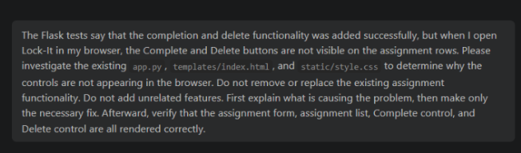
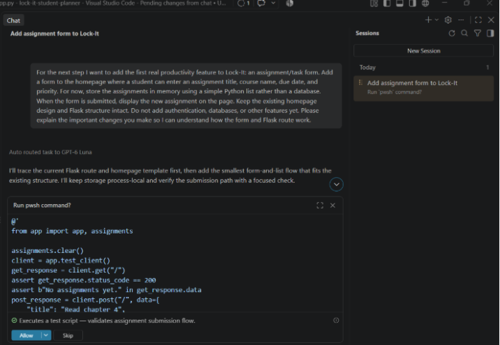
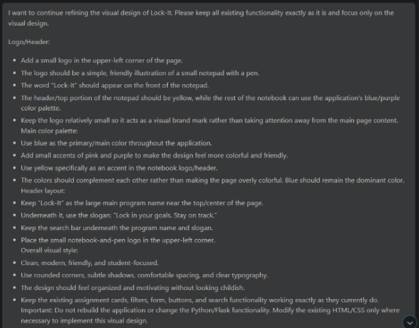
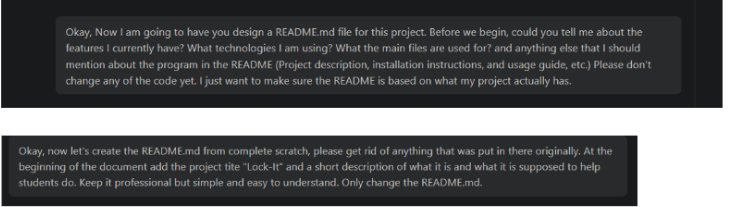
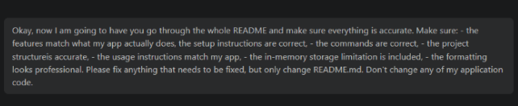

# Lock-It Project Reflection

Lock-It is a student planner designed to help students organize assignments and stay on track with their goals and deadlines. This reflection describes how I developed it with help from GitHub Copilot.

## 1. What did you ask Copilot to help you build? How did you break down the problem?

I asked Copilot to help me build a planner app called Lock-It: “Lock in your goals. Stay on track.” I originally planned to use Python, Flask, HTML, CSS, and JavaScript, but I later changed direction and built the project with Python, Flask, HTML, and CSS.

To brainstorm the project, I used a combination of ChatGPT and Copilot to organize my ideas and think about the files and structure I wanted. I first prompted Copilot on my computer outside of VS Code. After that, I went back and forth between VS Code Copilot and my personal Copilot. I asked for explanations so I could understand the file structure before letting Copilot start creating and editing files.

*My README notes from the early project brainstorming.*

*An early Copilot project-planning prompt from outside VS Code.*

I also ran into a setup problem because Python was not installed on my computer. I installed Python and restarted VS Code, which caused my original Copilot chat to be lost. Later, I accidentally deleted earlier Copilot responses after one of my responses confused it, so I had to restart from a previous branch and troubleshoot again.

*A screenshot from troubleshooting my Python setup.*

*A screenshot from a later troubleshooting step.*

Once I was ready to build, I broke the work into smaller steps. I started with a basic homepage so I could make sure the project structure ran properly. Then I asked Copilot to add an assignment form and test the submission flow. I tried to be specific about what I wanted and what I did not want, rather than giving the AI too many instructions at once. I also asked Copilot to explain its changes so I could follow the work step by step.

*The assignment form added after the basic homepage was working.*

*Assignment completion and deletion controls in Lock-It.*

As I continued, I asked Copilot to help refine the visual design. I also decided to add a monthly calendar so students could see when assignments were due. After the program was working, I used GitHub Copilot to help update the README with a project description, installation instructions, and a usage guide based on what I had built.

*The monthly calendar feature for viewing assignment due dates.*

*Using Copilot to work on the project README.*

## 2. How did your approach to asking questions change as you worked?

As I worked, my questions became more specific. At first, I was vague because I did not yet know exactly how I wanted the program to look or function. As I understood more of what Copilot was doing, it became easier to describe the changes I wanted and the things I wanted to avoid.

I no longer needed an explanation of every small detail, but I still asked Copilot to explain its work. I had read that asking for explanations might help reduce bugs. To me, it also encouraged a more step-by-step way of following what was happening. I did more troubleshooting and fact-checking as my questions became clearer.

*A final review of the project with Copilot.*

## 3. What parts of the development process with GitHub Copilot surprised you?

I was surprised by how quickly Copilot worked and how it could move between files and edit parts of the project that were not on the screen I was looking at. I was also surprised by how well it followed my instructions and helped design the interface.

The experience made me think about the future of web development and programming. AI tools could speed up parts of development and help programmers use languages and tools they do not know as well, while still working productively with them.

## 4. What did you learn about the technology you used that you didn't know before?

I did not know Copilot could help with backend development as well as the front end. Before this project, I thought I would have to write much more of the backend myself using the Python I knew, and that made me nervous about the assignment. Copilot helped with both sides of the application.

I am not really allowed to use Copilot in my coding classes, so this project gave me a chance to see how much AI assistance can contribute to development.

## 5. What would you do differently if you had to build this again?

If I built this project again, I would spend more time thinking about the features students might need and how the assignment-entry experience should work. I would redesign it more like a notepad, with space for a longer description and notes, so students could break an assignment into manageable parts instead of only seeing its title and due date.

I would also consider letting students add events they want to attend to the calendar, making the planner more personal. Overall, I would spend more time understanding what users need so the program avoids unnecessary features while still being useful.
